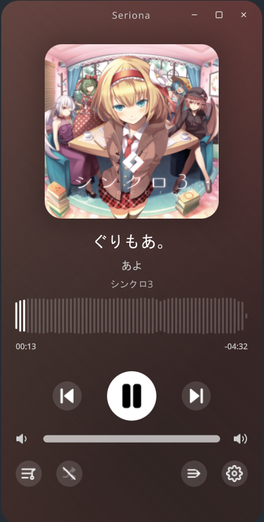
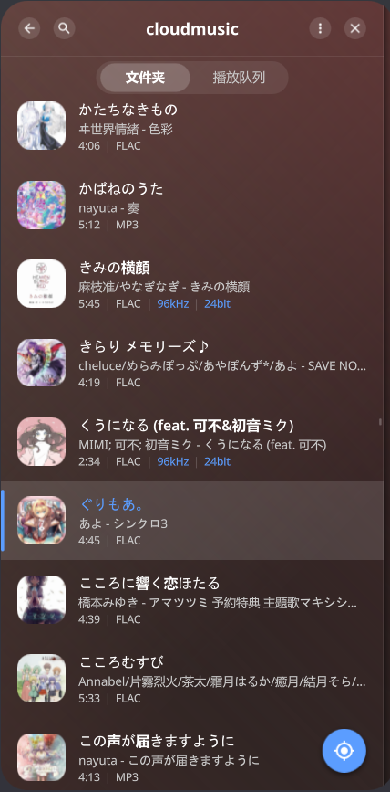
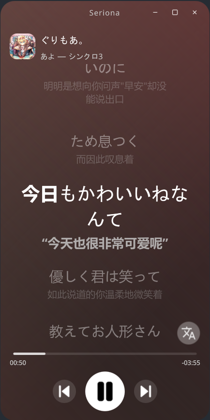
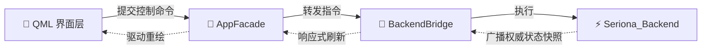

# Seriona

<div align="center">

**专为本地音乐爱好者打造的现代化桌面音乐播放器**

[](https://www.qt.io/)
[](https://en.cppreference.com/w/cpp/23)
[](./LICENSE)

[简介](#-简介) • [界面预览](#-界面预览) • [特性](#-特性一览) • [快速开始](#-快速开始) • [测试](#-测试) • [架构简述](#-架构简述) • [许可证](#-许可证)

</div>

---

## 📖 简介

**Seriona** 是一款基于 **Qt Quick (QML) + C++23** 构建的现代化本地音乐播放器前端。

界面主打沉浸与流畅：无边框磨砂窗口、基于专辑封面实时取色的动态流光背景、可交互的音频波形进度条、精准对齐的双语滚动歌词，以及深入多层目录依然能完美保留滚动位置的页面栈式侧栏导航。

项目采用**前后端解耦**架构，前端专注交互与视觉呈现，底层扫描与播放由 [Seriona_Backend](https://github.com/kaizen857/Seriona_Backend) 驱动，同时原生支持无后端的独立 **Mock 模式**，便于快速进行 UI 开发。

---

## 🖼️ 界面预览

<div align="center">

| 🎵 主播放界面 | 📂 侧栏多级曲库 | 📜 同步双语歌词 |
| :---: | :---: | :---: |
|  |  |  |

</div>

---

## ✨ 特性一览

- 🎨 **沉浸视觉**：自适应专辑封面 3 色动态流动背景、无边框原生手感窗口拖拽与缩放。
- 📊 **波形进度条**：基于真实音频能量渲染的可视化进度条，支持毫秒级精准拖拽跳转。
- 📂 **平滑目录浏览**：逐级深入文件夹浏览，各层级独立记忆滚动位置，切页丝滑过渡。
- 🔍 **即时搜索与排序**：支持当前子树范围即时搜索，支持为不同文件夹定制专属排序偏好。
- 🎵 **双语滚动歌词**：时间戳精确同步滚动，支持中外文分行与翻译一键显隐。
- 🔀 **解耦双游标**：正在播放的曲目与正在翻找浏览的焦点互不干扰。
- 🛠️ **独立 Mock 模式**：无需配置后端依赖即可秒级启动，全功能体验 UI 交互。

---

## 🚀 快速开始

### 依赖要求
- 支持 **C++23** 的编译器（GCC 13+ / Clang 17+ / MSVC 2022+）
- **Qt 6.8+**（需包含 Quick, Concurrent, Widgets 模块）
- **CMake ≥ 3.16**

### 构建与运行

```bash
# 克隆代码
git clone https://github.com/kaizen857/Seriona.git
cd Seriona

# 编译并运行（默认自动关联同级目录的 ../Seriona_Backend）
cmake -B build -DCMAKE_BUILD_TYPE=Release
cmake --build build -j$(nproc)
./build/appSeriona
```

> **💡 提示：纯前端 Mock 模式启动**  
> 如果暂时不想配置后端依赖，只需执行：  
> `cmake -B build -DSERIONA_BACKEND_SOURCE_DIR="" && cmake --build build`  
> 即可启动纯前端界面进行预览与调试。

---

## 🧪 测试

```bash
# 运行单元测试
ctest --test-dir build --output-on-failure

# 运行自动化无头场景冒烟测试
QT_QPA_PLATFORM=offscreen ./build/appSeriona --smoke-scenario=main-playback --smoke-exit-ms=1000
```

---

## 🏛️ 架构简述

前端严格遵循**命令-快照单向数据流**设计，由单一门面中介者 `AppFacade` 统一调度：



- **单向不可变数据流**：UI 仅表达用户意图并派发强类型指令（Command），界面的改变完全由后端广播的权威快照（Snapshot）驱动，杜绝并发状态不一致。
- **单一中介者门面**：`AppFacade` 是 QML 层可见的唯一 C++ 组合根，统一收敛播放、曲库、歌词等子控制器。
- **双游标解耦**：播放游标（`playingTrackId`）与浏览焦点（`selectedBrowserNodeId`）独立，翻找曲库不影响正在播放的曲目。

---

## 🔗 相关项目

- **[Seriona_Backend](https://github.com/kaizen857/Seriona_Backend)**：专为 Seriona 打造的 C++23 音频扫描、元数据缓存与播放核心。
- **[TagReader](https://github.com/kaizen857/TagReader)**：高性能 C++23 音频标签解析与内嵌封面提取库。

---

## 📄 许可证

本项目基于 [GPL-3.0](./LICENSE) 许可证开源。
